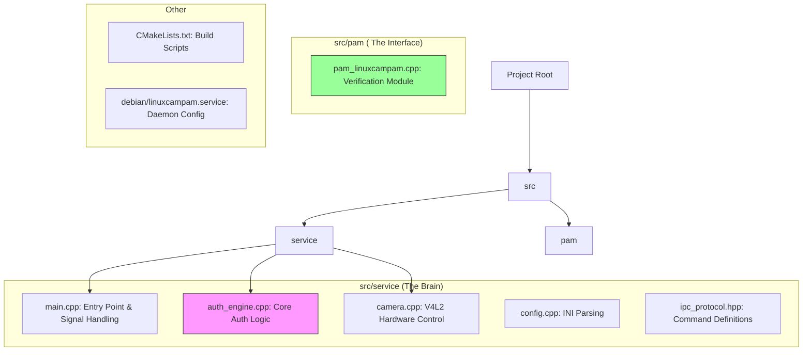
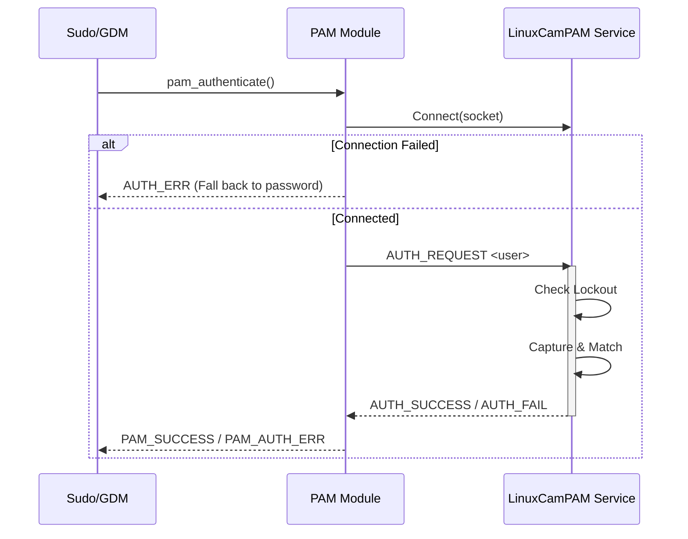

# LinuxCamPAM System Architecture

## 1. Contributor's Map: "Where is the Code?"

This map shows where key logic resides in the source tree.



## 2. Data Flow: From Camera to Decision

Follow the path of a video frame through the processing pipeline.

```mermaid
flowchart LR
    Cam[Camera Hardware] -->|Raw Frame (YUYV/MJPG)| V4L2[V4L2 Wrapper]
    V4L2 -->|cv::Mat (BGR)| Preproc[Preprocessing]
    
    subgraph "AuthEngine Pipeline"
        Preproc -->|Resized| Detect[YuNet: Face Detection]
        Detect -->|Face ROI| Align[Face Alignment]
        Align -->|Aligned Face (112x112)| Recog[SFace: Recognition]
        Recog -->|128D Vector| Embedding[Face Embedding]
        
        Embedding --> Match{Cosine Similarity}
        DB[(Stored Embeddings)] --> Match
    end
    
    Match -->|Score > Threshold| Result[Success]
    Match -->|Score < Threshold| Result[Fail]
```

## 3. System Context

How the pieces fit together on your Linux system.

```mermaid
graph TD
    User((User)) -->|Runs Command| Sudo[sudo / login]
    Sudo -->|Loads| PAMModule[pam_linuxcampam.so]
    
    PAMModule -->|Socket IPC| Daemon[linuxcampamd (Root)]
    
    Daemon -->|Controls| Camera[Webcam]
    Daemon -->|Reads| Config[/etc/linuxcampam/config.ini]
    Daemon -->|Reads| Models[/etc/linuxcampam/users/*.json]
    
    style Daemon fill:#ff9,stroke:#333
    style PAMModule fill:#99f,stroke:#333
```

## 4. Authentication Sequence

Detailed interaction between the PAM module and the Daemon.


