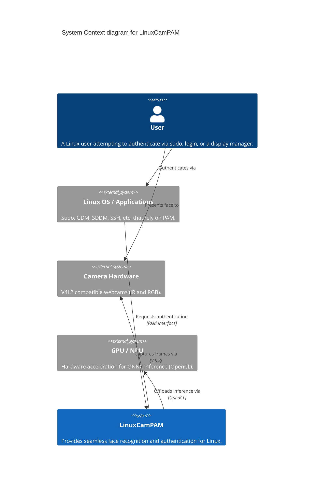
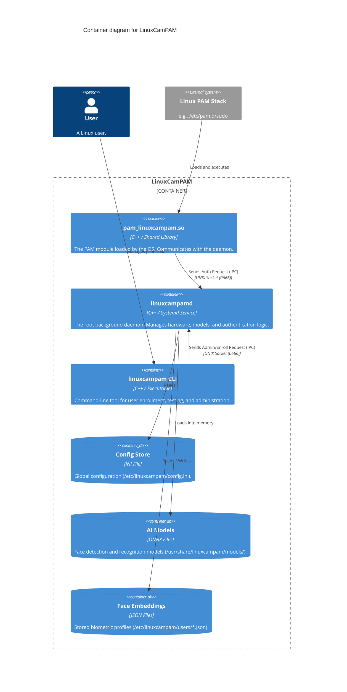
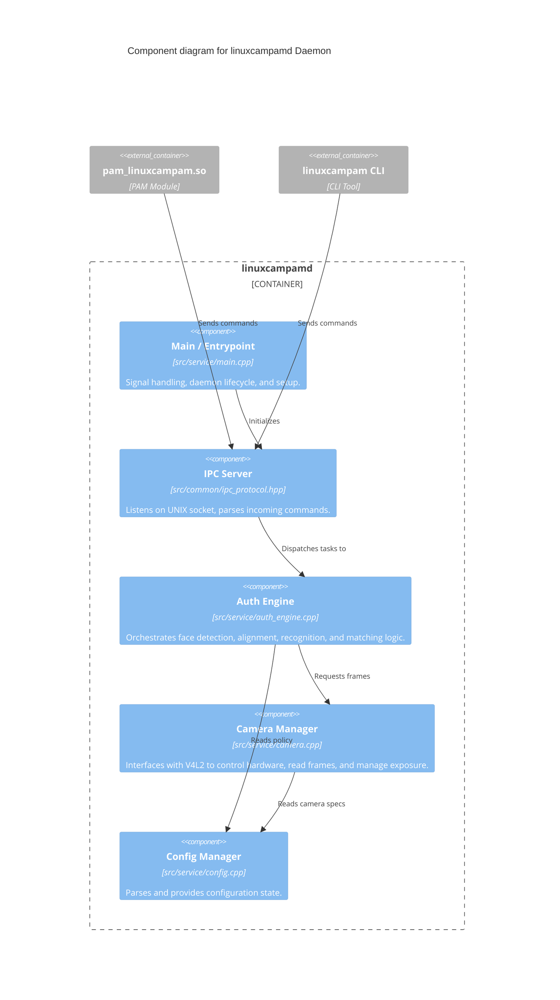
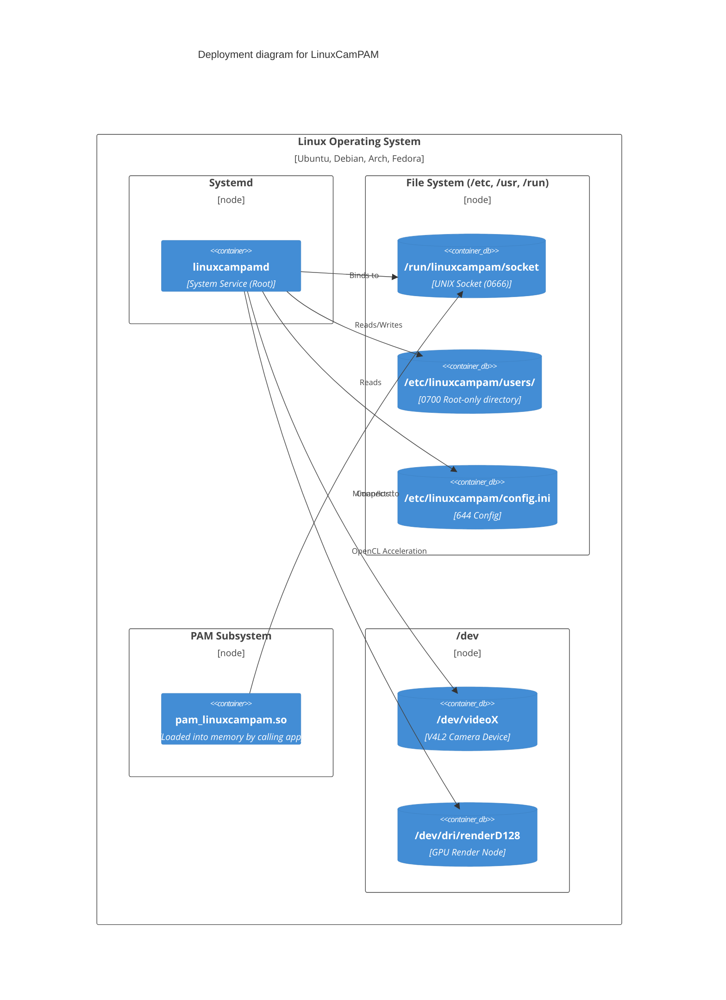

# LinuxCamPAM Software Architecture

This document provides a comprehensive overview of the LinuxCamPAM architecture, following the [C4 model](https://c4model.com/) standard. It is intended for new contributors, maintainers, and security auditors.

> [!TIP]
> **Architecture Decision Records (ADRs):** For the reasoning behind key design choices (e.g., why OpenCL is used, or why UNIX sockets were chosen), please refer to the `docs/adr/` directory.

---

## 1. Context View (Level 1)

The Context diagram shows how LinuxCamPAM fits into the overall ecosystem. It acts as an intermediary between the user, the operating system's authentication layer (PAM), and the camera hardware.



---

## 2. Container View (Level 2)

The Container diagram zooms into the LinuxCamPAM system to show the high-level executable components, data stores, and their interactions.



---

## 3. Component View (Level 3)

Zooming into the core `linuxcampamd` daemon to understand the internal software structure.



### Authentication Sequence (Data Flow)

When `pam_linuxcampam.so` triggers an authentication request, the Auth Engine executes the following pipeline:

1. **Capture**: The Camera Manager pulls a frame from the `/dev/video*` device (applying frame averaging or HDR if configured).
2. **Pre-processing**: The image is converted to BGR and resized.
3. **Detection**: The YuNet ONNX model detects faces and returns Regions of Interest (ROI) and facial landmarks.
4. **Alignment**: The face is cropped and affine-transformed (aligned) based on landmarks (eyes, nose, mouth) to a fixed `112x112` grid.
5. **Recognition**: The SFace ONNX model extracts a 128-dimensional embedding vector from the aligned face.
6. **Matching**: Cosine similarity is calculated between the live vector and the stored vectors in `/etc/linuxcampam/users/<user>.json`.
7. **Decision**: If similarity > `threshold` (default `0.363`), authentication succeeds.

---

## 4. Deployment View

This view illustrates how the software is physically deployed on a target Linux machine.



---

## 5. Data & State View

### User Embeddings (`/etc/linuxcampam/users/*.json`)

User biometric profiles are strictly isolated to the `/etc/linuxcampam/users/` directory. Files are named `<username>.json` and are secured with `0600` permissions (owned by `root`).

```json
{
  "username": "vlad",
  "embeddings": [
    {
      "label": "default",
      "timestamp": 1717280000,
      "camera_type": "ir",
      "vector": [0.123, -0.456, 0.789, ...] // 128-dimensional float array
    }
  ]
}
```

### Configuration (`/etc/linuxcampam/config.ini`)

The configuration dictates hardware usage, logging, and security policies (e.g., `lockout_attempts`). See [CONFIGURATION.md](CONFIGURATION.md) for detailed property descriptions.

---

## 6. Security Boundaries

LinuxCamPAM relies heavily on Linux filesystem and process boundaries for security. For an in-depth threat model, refer to [THREAT_MODEL_AND_RISK_ASSESSMENT.md](THREAT_MODEL_AND_RISK_ASSESSMENT.md).

*   **Process Isolation**: The PAM module runs in the user-space context of the calling application (e.g., `sudo`). It possesses zero biometric processing capabilities and relies entirely on the IPC socket.
*   **Root Daemon**: `linuxcampamd` runs as root. This is strictly required to read from `/dev/video*`, write to the root-owned JSON databases, and drop root privileges dynamically when verifying file ownership.
*   **IPC Socket**: Located at `/run/linuxcampam/socket` with `0666` permissions. While world-writable, the daemon meticulously sanitizes input strings (usernames) and only returns boolean states (`AUTH_SUCCESS`/`AUTH_FAIL`), preventing memory leaks or data exfiltration.

---

## 7. Cross-Cutting Concerns

### Hardware Acceleration (OpenCL)
We prioritize **OpenCL** via OpenCV's Transparent API (T-API) rather than proprietary CUDA or bloated OpenVINO static libraries. This allows a single ~15MB binary to leverage GPU acceleration on Intel, AMD, NVIDIA, and ARM devices identically.
*   *Fallback*: If OpenCL is unavailable (or the driver hangs), the system falls back to optimized CPU instructions (AVX2/NEON).

### Rate Limiting (Brute-Force Protection)
Statefulness is maintained in-memory within the `auth_engine.cpp`. If a user fails authentication `lockout_attempts` times (default 5), they are denied service for `lockout_duration_sec` (default 300s). This state is cleared on daemon restart.
