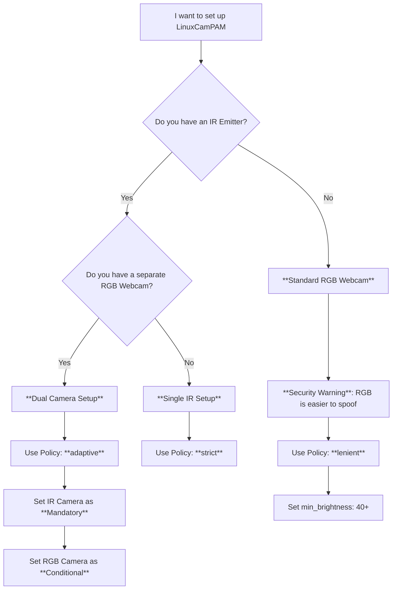
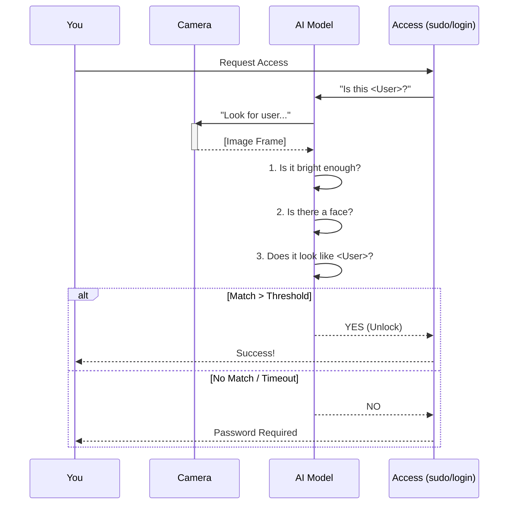

# LinuxCamPAM Visual Guides

This document contains visual guides to help you configure, troubleshoot, and use LinuxCamPAM effectively.

## 1. Troubleshooting Wizard: "Why is it failing?"

Use this flowchart to diagnose authentication issues.

```mermaid
graph TD
    Start[Authentication Failed] --> Q1{Did the Camera/IR Light Turn On?}
    
    Q1 -- No --> CheckService[Check Service Status]
    CheckService --> Cmd1["sudo systemctl status linuxcampam"]
    Cmd1 --> Q2{Is Active/Running?}
    Q2 -- No --> Restart[sudo systemctl restart linuxcampam]
    Q2 -- Yes --> CheckLog["journalctl -u linuxcampam -f"]
    CheckLog --> Err{See Error?}
    Err -- "Device Busy" --> CloseApp[Close other camera apps &#40;Cheese, Zoom&#41;]
    Err -- "No Camera" --> Config[Check /etc/linuxcampam/config.ini path]

    Q1 -- Yes --> Q3{Did it recognize you?}
    Q3 -- No/Unknown --> TestCmd["Run: linuxcampam test"]
    TestCmd --> Result{Result?}
    
    Result -- "No Face Detected" --> Lighting[Check Lighting / Position]
    Lighting --> EnrollAgain
    
    Result -- "Face Detected, Low Score" --> Retrain[Retrain Model]
    Retrain --> CmdTrain["linuxcampam train <user>"]
    
    Result -- "Too Dark" --> MinBright[Lower 'min_brightness' in config]
    
    Result -- "Success" --> PAM{Fails only in Sudo?}
    PAM -- Yes --> PAMConfig[Check /etc/pam.d/sudo]
    
    style Start fill:#f96,stroke:#333
    style Cmd1 fill:#eee,stroke:#333,stroke-dasharray: 5 5
    style CmdTrain fill:#eee,stroke:#333,stroke-dasharray: 5 5
    style TestCmd fill:#eee,stroke:#333,stroke-dasharray: 5 5
```



## 2. Configuration Helper: "Which Setup is Right for Me?"

Choose the right configuration based on your hardware.



## 3. The Authentication Process (Simplified)

How the system decides to let you in.



## 4. Enrollment Quality Loop

Bad enrollment data is the #1 cause of failure. Follow this loop for best results.

```mermaid
stateDiagram-v2
    [*] --> GoodLighting
    GoodLighting --> Capture: Run 'linuxcampam add user'
    
    state "Capture Conditions" as Capture {
        AvoidBacklight: No window behind you
        StraightFace: Look directly at camera
        NoGlasses: Remove heavy reflection
    }
    
    Capture --> Verify: Run 'linuxcampam test'
    
    state "Verification" as Verify {
        CheckScore: Score > 0.6 is GOOD
        CheckSpeed: Time < 300ms is GOOD
    }
    
    Verify --> Quality{Is Quality Good?}
    Quality --> Yes: Done
    Quality --> No: TrainMore
    
    TrainMore: Run 'linuxcampam train user'
    TrainMore --> Capture: (Add variations: glasses, angles)
```
